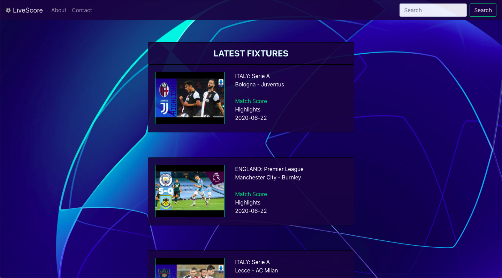
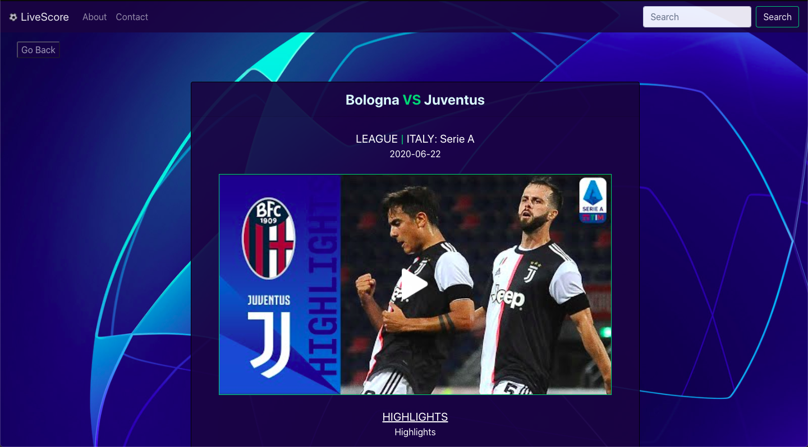

# ScoreCast

ScoreCast is a web app using the React front-end JavaScript library. It can also be used on mobile devices. The application implements a number of JS/React features. For this application I had chosen to create a live score application for the latest football matches using the Scorebat.com free public API. The application in short, uses a fetch statement to retrieve a json file and display a number of objects from this API on screen. It also allows users to view the latest football scores from the most popular leagues offered. It provides information highlights, video highlights, team information and other features offered by this API.

Link to this app hosted on Firebase: https://scorecastlive.web.app/

